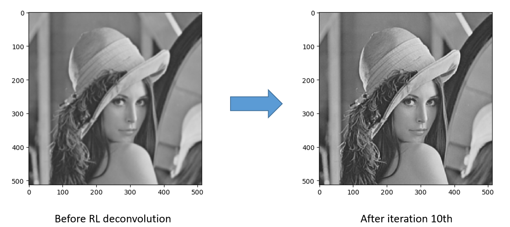
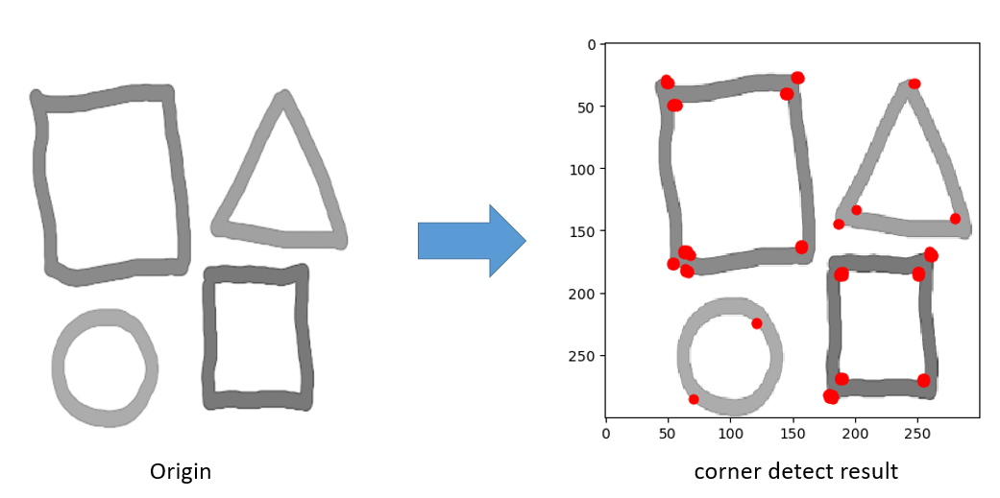
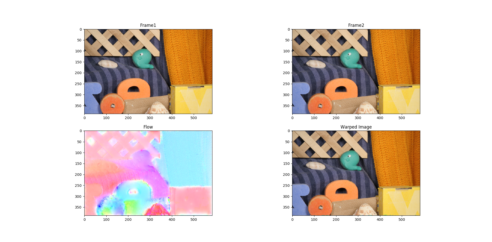
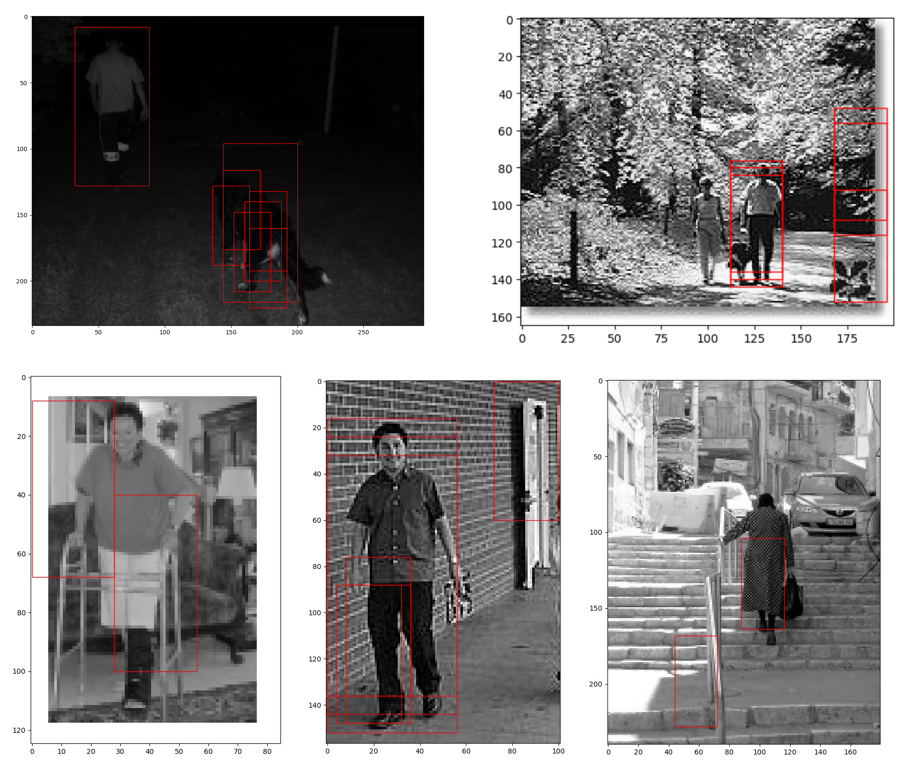

# ENGG5104-ComputerVision
homeword and project of ENGG5104
===============================================

## Directory
* [Homework1](./homework1)
* [Homework2](./homework2)
* [Homework3](./homework4)
* [Homework4](./homework4)

****
## **Homework1**
	Several basic skills for computer vision, such as compression, corner detection, ...etc

### Result:
	Richardson-Lucy Deconvolution Result:

	Harris Corner Detection Result:

****
## **Homework2**
SIFT

****
## **Homework3**
	Horn-Schunck Optical Flow Estimation

### Result:

****
## **Homework4**
	Pedestrian Detection-with HOG & SVM

### Result:
