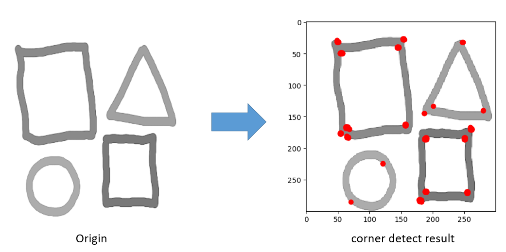

Introduction
=======================================
This is the solution for the homework1 of ENGG5104-computer vision.

## Directory
* [Image compression](#image-compression)
* [Richardson Lucy Deconvolution](#richardson-lucy-deconvolution)
* [Harris Corner Detection](#harris-corner-detection)
* [Bilateral Filter](#bilateral-filter)

****
## **Image compression**
<!-- --------------------------------------- -->
	This is a implement of the JPEG compression function. Image compression schemes aim to decrease 
	the number of bits used to represent the image.

### Algorithm:
1. Block splitting: Splitting the image into 8*8 blocks.
2. Discrete cosine transform: Each 8×8 block 𝐹 is converted to a frequency-domain representation 𝐺 (of size 8-by-8), using a normalized, two-dimensional type-II discrete cosine transform (DCT).
3. Quantization: Using a predefined quantization matrix to control compression ratio.
4. Decoding: decode using inverse discrete cosine transform (inverse DCT) from the quantized DCT coefficients.

### Reference: 
* <http://en.wikipedia.org/wiki/JPEG>
* [Image Compression and the Discrete Cosine Transform][ref1]

### Example result: 

****
## **Richardson-Lucy Deconvolution**
<!-- --------------------------------------- -->
	Richardson-Lucy algorithm is an *iterative* procedure for recovering a latent image that 
	has been blurred by a known **point spread function(PSF)**

### Reference: 
* <http://en.wikipedia.org/wiki/Richardson–Lucy_deconvolution>

### Example result: 

****
## **Harris Corner Detection**
<!-- --------------------------------------- -->
	Harris corner detection algorithm is used for detecting corner in the image. It considers 
	the corner point with respect to both vertical and horizontal direction.

### Reference: 
* <https://en.wikipedia.org/wiki/Corner_detection>
* [A combined corner and edge detector][ref2]

### Example result: 

****
## **Bilateral Filter**
<!-- --------------------------------------- -->
	Bilateral filter is a non-linear, edge-preserving filter to smooth images.

### Reference: 
* <https://en.wikipedia.org/wiki/Bilateral_filter>

### Example result: 

---------------------------------------------------------
[ref1]:https://www.math.cuhk.edu.hk/~lmlui/dct.pdf "ref1"
[ref2]:http://citeseerx.ist.psu.edu/viewdoc/download?doi=10.1.1.434.4816&rep=rep1&type=pdf "ref2"