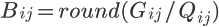

Introduction
=======================================
This is the solution for the homework1 of ENGG5104-computer vision.

## Directory
* [Image compression](#image)
* [Richardson-Lucy Deconvolution](#richardson-lucy deconvolution)
* [Harris Corner Detection](#harris corner detection)
* [Bilateral Filter](#bilateral filter)
* [Readme](#readm)

****
## Image compression
<!-- --------------------------------------- -->
	This is a implement of the JPEG compression function. Image compression schemes aim to decrease 
	the number of bits used to represent the image.

### Algorithm:
1. Block splitting: Splitting the image into 8*8 blocks.
2. Discrete cosine transform: Each 8×8 block 𝐹 is converted to a frequency-domain representation 𝐺 (of size 8-by-8), using a normalized, two-dimensional type-II discrete cosine transform (DCT).
3. Quantization: Using a predefined quantization matrix to control compression ratio. Define Q as the quantization matrix. The quantized DCT coefficient are computed as

4. Decoding: decode using inverse discrete cosine transform (inverse DCT) from the quantized DCT coefficients 𝐵𝑖𝑗.
### Reference: 
<http://en.wikipedia.org/wiki/JPEG>  

### Example result: 

****
## Richardson-Lucy Deconvolution
<!-- --------------------------------------- -->

****
## Harris Corner Detection
<!-- --------------------------------------- -->

****
## Bilateral Filter
<!-- --------------------------------------- -->