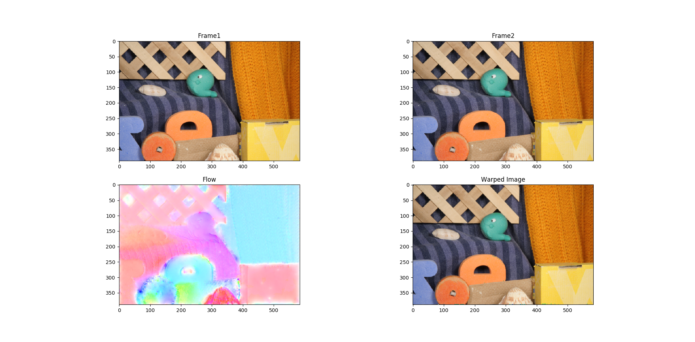
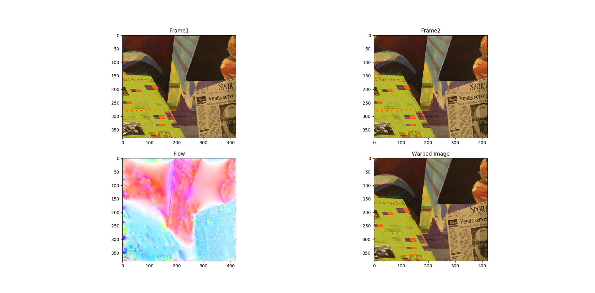

Introduction
================================
This is the solution for the homework3 **Optical Flow Estimation**.

## Directory
* [Background](#background)
* [Algorithm](#algorithm)
* [Example result](#example-result)
* [Reference](#reference)

****
## **Background**
Motion estimation among a sequence of images is a widely used task in computer vision, such as image segmentation, object classification, and driver assistance.    
In this community, researchers use **‘optical flow’** to describe the motion field. ‘Optical flow’ is a dense vector field, where a 2D displacement vector is calculated for each pixel. The displacement vector points to its corresponding pixel from another image.    
In this assignment, we will implement the modern version of `Horn-Schunck method`. Also we use `pyramid-based` coarse-to-fine scheme to achieve better performance, similar to that of `Lucas-Kanade` method.

****
## **Algorithm**
	Input: frame1, frame2, lambda
	Build image pyramid;
	Initialize flow = 0;
	For I = numPyramidLevel downto 1
		Initialize flow from previous level;
		Build gradient matrix and Laplacian matrix;
		For j = 1:maxWarpingNum
			Warp image using flow vector;
			Computer image gradient Ix, Iy, and Iz;
			Build linear system to solve HS flow;
			Solve linear system to compute the flow;
			Use median filter to smooth the flow map;
		EndFor
	Output: flow

****
## **Example result**

<!--  -->

****
## **Reference**
* [Horn–Schunck method][ref1]

----------------------------------------------------------
[ref1]:https://en.wikipedia.org/wiki/Horn%E2%80%93Schunck_method "ref1"