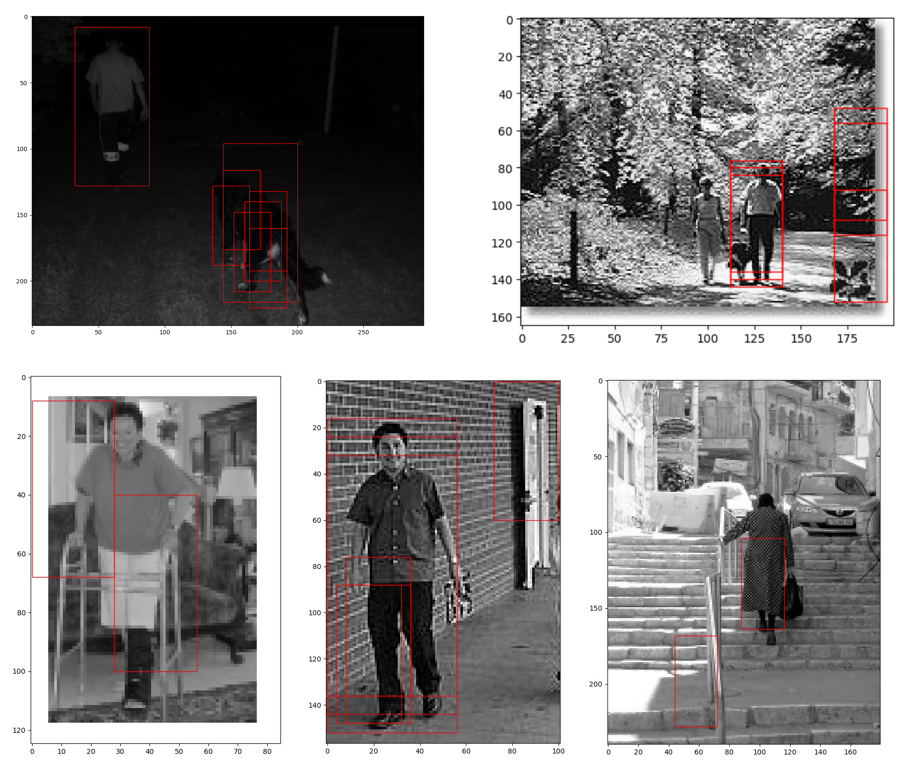

Introduction
=======================================
This is the solution for the homework4 **Pedestrian Detection**.

## Directory
* [Background](#background)
* [Task](#task)
* [Example result](#example-result)
* [Reference](#reference)

****
## **Background**
Pedestrian detection is a challenging problem in computer vision. One of the typical and effective frameworks applies `histogram of gradient (HOG)` as descriptor and `linear SVM` to train the pedestrian detector.

****
## **Task**
	TODO#1: Compute angle and magnitude of gradient for each pixel (function: ExtractHOG)
	TODO#2: Construct HOG for each cell(function: ExtractHOG)
	TODO#3: Construct the normalized HOG for each block (function: ExtracteHOG)
	TODO#4: Convolute the learned detector on the HOG descriptor of the novel image(function: TrainMultipleComponent)
	TODO#5: Select the convolution above the threshold and compute its bounding box(function: TrainMultipleComponent )
	TODO#6: Build image pyramid(function: MultiscaleDetection)
	TODO#7: Perform detection on multiple scales of image(function: MultiscaleDetection)

****
## **Example result**

****
## **Reference**
* [HOG tutorial][ref1]
* [HOG introduction][ref2]
* [Histograms of Oriented Gradients for Human Detection][ref3]

-----------------------------------------------
[ref1]:http://mccormickml.com/2013/05/09/hog-person-detector-tutorial/ "ref1"
[ref2]:https://en.wikipedia.org/wiki/Histogram_of_oriented_gradients "ref2"
[ref2]:http://lear.inrialpes.fr/people/triggs/pubs/Dalal-cvpr05.pdf "ref3"